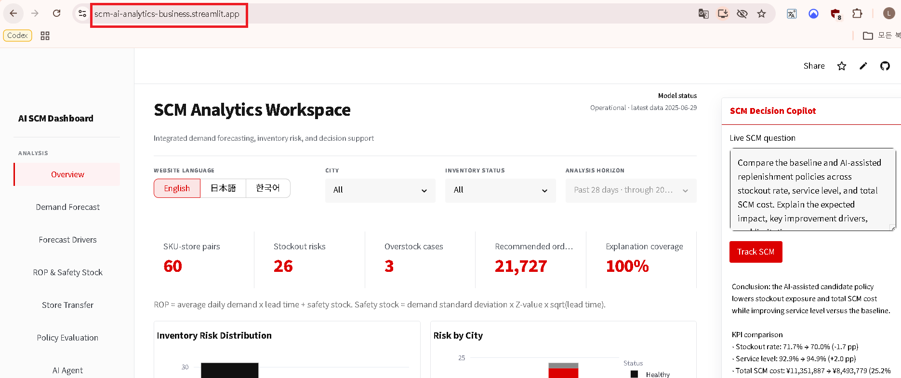
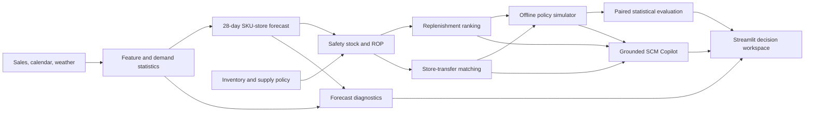
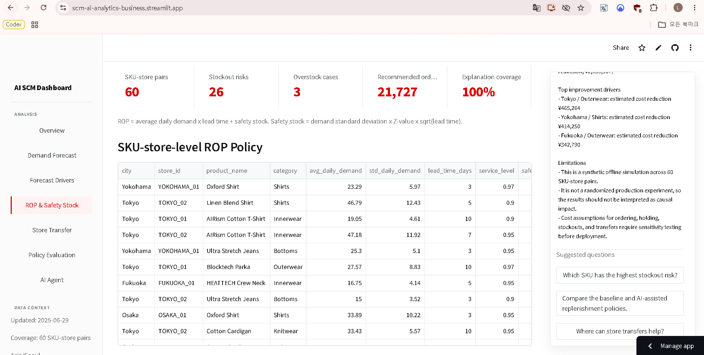
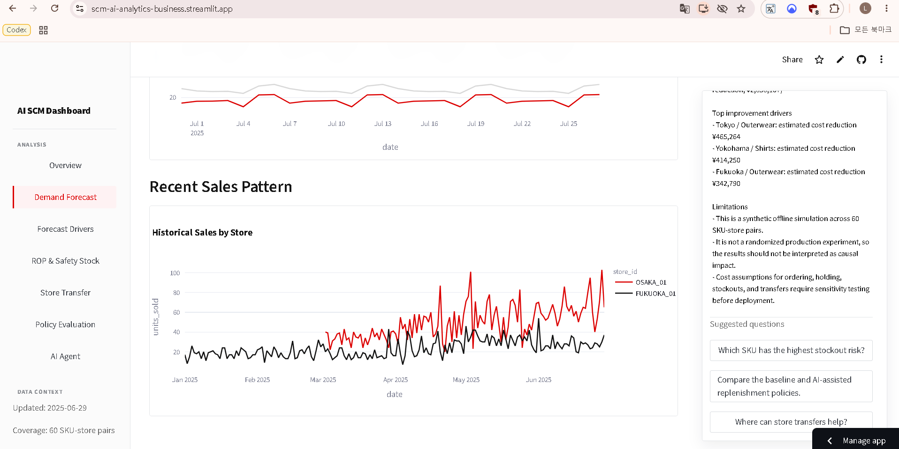
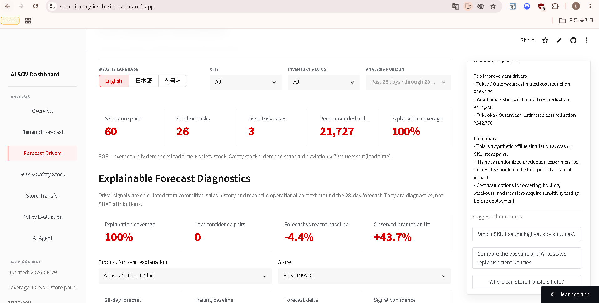
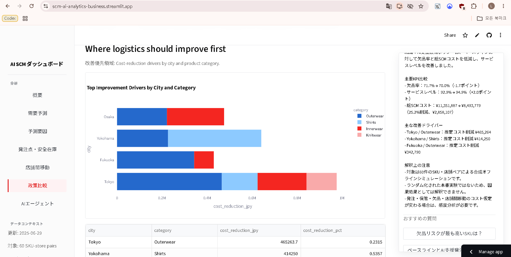
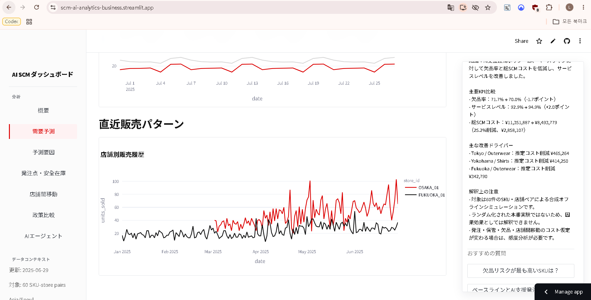
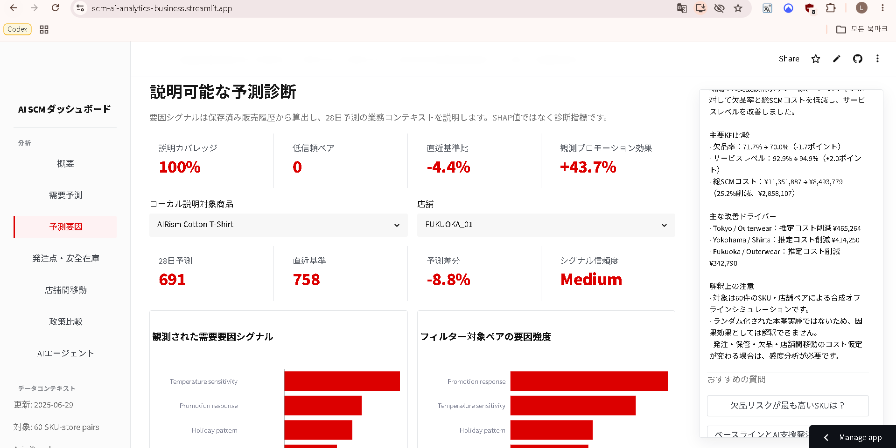

# SCM AI Analytics Business

**Explainable demand forecasting, inventory policy optimization, and decision intelligence for retail supply-chain operations.**

[](https://scm-ai-analytics-business.streamlit.app)
[](runtime.txt)
[](https://github.com/Lee2379/scm-ai-analytics-business/actions/workflows/ci.yml)
[](LICENSE)

> Portfolio project for senior data-science / AI-engineering roles. The application joins forecasting, inventory control, offline policy evaluation, explainability, and an SCM decision copilot in one deployable product.

## Live Product

**Deployment:** [scm-ai-analytics-business.streamlit.app](https://scm-ai-analytics-business.streamlit.app)

The deployed application supports English, Japanese, and Korean interfaces. It operates entirely on synthetic retail data, and its public Copilot falls back to deterministic, data-grounded decision logic when no external model key is configured.



## Executive Summary

Retail planners rarely need another forecast table. They need an operating system that converts uncertain demand into defensible actions: what to order, where to transfer inventory, which recommendation to investigate, and whether a proposed policy is economically better than the current one.

This project implements that workflow end to end:

1. builds 28-day SKU-store demand forecasts;
2. calculates safety stock and reorder points from demand variability, service levels, and lead time;
3. ranks replenishment actions by shortage severity and forecast coverage;
4. recommends store-to-store inventory transfers where surplus can cover shortage;
5. generates diagnostic forecast-driver signals and confidence labels;
6. evaluates a constrained AI-assisted policy against a planner baseline;
7. exposes the results through a multilingual Streamlit workspace and grounded decision Copilot.

## Decision KPIs

| KPI | Current snapshot | Interpretation |
|---|---:|---|
| SKU-store pairs monitored | 60 | Decision grain used across forecasting and inventory policy |
| Stockout-risk pairs | 26 | Current stock is below the calculated reorder point |
| Overstock cases | 3 | Inventory can potentially support transfer or order avoidance |
| Recommended order units | 21,727 | Aggregate replenishment quantity for the 28-day horizon |
| Explanation coverage | 100% | Every monitored pair has diagnostic driver context |

### Offline policy simulation

| Metric | Planner baseline | AI-assisted candidate | Change |
|---|---:|---:|---:|
| Stockout rate | 71.7% | 70.0% | **-1.7 pp** |
| Service level | 92.9% | 94.9% | **+2.0 pp** |
| Total SCM cost proxy | ¥11,351,887 | ¥8,493,779 | **-25.2%** |

These results are from a **synthetic paired offline simulation**, not a randomized production experiment. The cost result is statistically strong in the simulated sample; the stockout-flag McNemar test is not significant at 0.05. See [Modeling and Evaluation](docs/MODELING_AND_EVALUATION.md) for the complete interpretation.

## System Architecture



The design separates analytical computation from presentation. CSV outputs form explicit data contracts between the SCM engine, evaluation layer, agent context builder, and deployed UI.

## Product Walkthrough

### 1. Replenishment decisions at SKU-store level

The action table combines stock on hand, ROP, safety stock, 28-day forecast, recommended quantity, priority, and plain-language rationale. The Copilot uses the same reviewed tables rather than an unbounded knowledge source.



### 2. Demand forecast and recent sales pattern

The forecast view compares the next 28 days across stores and keeps the recent observed sales pattern visible for context. Repeating peaks reflect calendar effects in the synthetic retail scenario.



### 3. Explainable forecast diagnostics

The diagnostics layer reports explanation coverage, low-confidence pairs, deviation from a trailing baseline, observed promotion lift, and local driver signals. These are operational diagnostics derived from committed sales history—not SHAP values and not causal effects.



### 4. Offline policy evaluation

The policy workspace surfaces the business result and its limits together. City-category improvement drivers show where simulated cost reduction is concentrated, while the Copilot explicitly states that causal impact has not been established.



## Multilingual Operations

Japanese screens are included as localization evidence rather than replacing the English portfolio narrative. Labels, decision summaries, KPI explanations, and Copilot responses are localized while product and store identifiers remain stable.

<details>
<summary><strong>Japanese workspace and policy-comparison response</strong></summary>






</details>

## Analytical Methods

### Demand forecast

The forecast engine estimates recent SKU-store demand level and variability, adds deterministic calendar structure, and produces a reproducible 28-day horizon. This implementation prioritizes traceability and decision integration over benchmark-chasing on synthetic data.

### Inventory policy

```text
Safety stock = demand standard deviation × service-level Z × √lead time
Reorder point = average daily demand × lead time + safety stock
Target stock = 28-day forecast + safety stock
Recommended order = max(target stock - stock on hand, 0)
```

### Transfer policy

The transfer engine matches shortage pairs with surplus inventory for the same SKU, constraining movement by available surplus and receiving-store need.

### Explainability

Observed signals include promotion response, weekend pattern, holiday pattern, temperature sensitivity, recent momentum, volatility, and deviation from a trailing baseline. Confidence is assigned from demand volatility and used to prioritize the exception queue.

### Policy evaluation

The candidate policy combines constrained replenishment with partial transfer realization. Evaluation uses paired SKU-store outcomes, paired t-tests for continuous KPI differences, and an exact McNemar test for stockout-state changes.

## Decision Copilot

The Copilot supports four controlled intent families:

- reorder and stockout prioritization;
- safety-stock explanation;
- store-transfer recommendations;
- baseline-versus-candidate policy comparison.

Local responses are generated from reviewed analytical tables. Optional Gemini integration is isolated behind environment variables and a supplied-data-only prompt. No secret is committed to the repository.

## Repository Structure

```text
.
├── app.py                         # Streamlit decision workspace
├── src/
│   ├── scm_engine.py              # Forecast, ROP, replenishment, transfer logic
│   ├── policy_evaluation_simulation.py
│   └── agent.py                   # Context builder and grounded Copilot
├── data/                          # Synthetic inputs and reproducible outputs
├── tests/                         # Unit and regression tests
├── docs/                          # Architecture, evaluation, decisions, deployment
├── assets/screenshots/            # High-resolution deployment evidence
└── .github/workflows/ci.yml       # Automated validation
```

## Run Locally

```bash
python -m venv .venv
source .venv/bin/activate  # Windows: .venv\Scripts\activate
python -m pip install -r requirements.txt
python -m streamlit run app.py
```

Open `http://localhost:8501`.

### Rebuild analytical outputs

```bash
python -m src.scm_engine
python -m src.policy_evaluation_simulation
```

### Run tests

```bash
python -m pytest -q
```

## Engineering and Governance

- deterministic synthetic dataset and reproducible output tables;
- explicit metric definitions and paired evaluation grain;
- conservative language around correlation, simulation, and causality;
- secrets excluded through `.gitignore` and example-only configuration;
- public demo works without external LLM credentials;
- multilingual UI tested against a stable identifier layer;
- CI checks compilation, unit tests, and output-contract integrity.

## Documentation

- [Architecture and Data Contracts](docs/ARCHITECTURE.md)
- [Modeling and Evaluation](docs/MODELING_AND_EVALUATION.md)
- [Decision Intelligence and Copilot](docs/DECISION_INTELLIGENCE.md)
- [Deployment, Privacy, and Operations](docs/DEPLOYMENT_AND_PRIVACY.md)

## Limitations and Next Steps

- Replace synthetic data with governed POS, inventory, lead-time, and supplier feeds.
- Add rolling-origin forecast backtests against seasonal-naive and statistical baselines.
- Calibrate cost assumptions with finance and operations owners.
- Run a shadow-mode production pilot before any automated ordering.
- Add drift, service-level, override, and realized-savings monitoring.
- Introduce role-based access and audit logging for enterprise deployment.

## License

MIT License. See [LICENSE](LICENSE).
