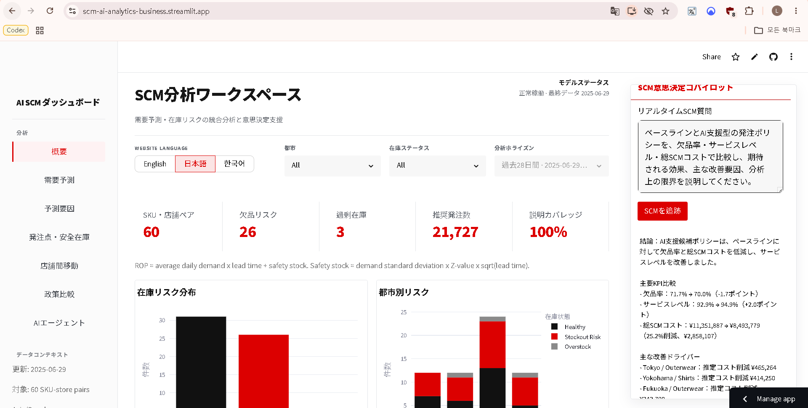
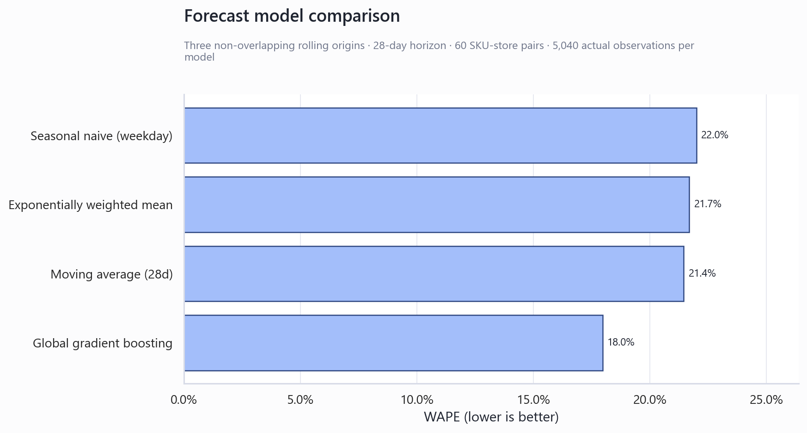
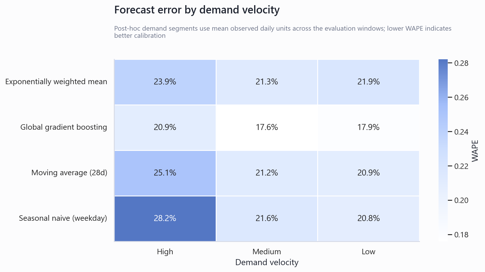
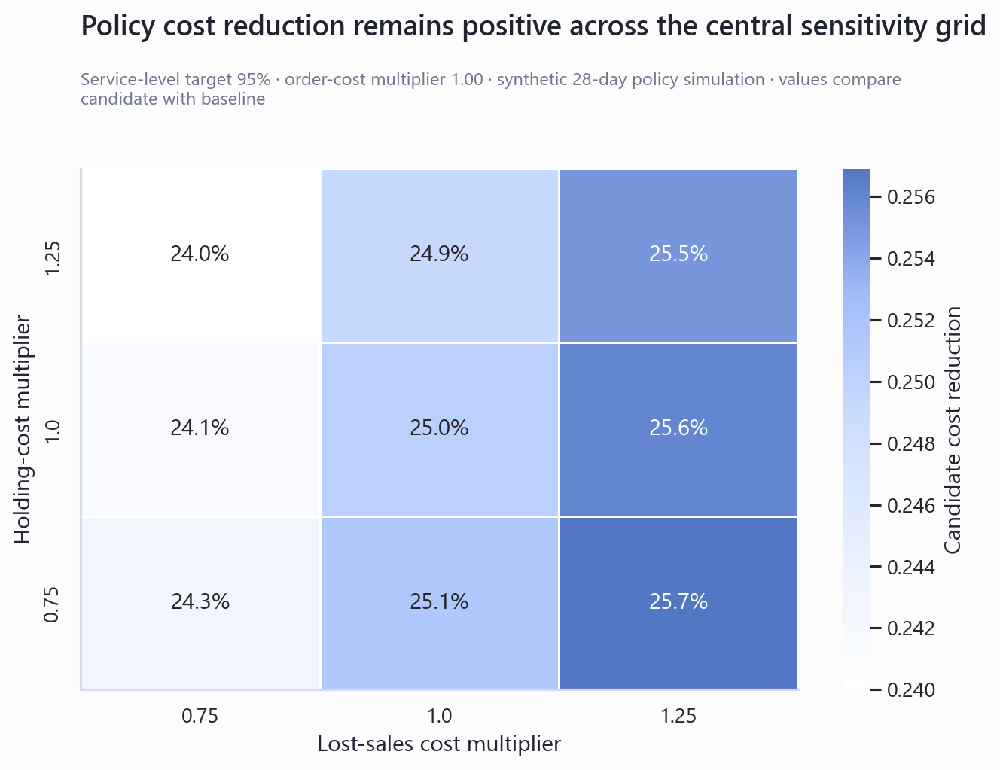
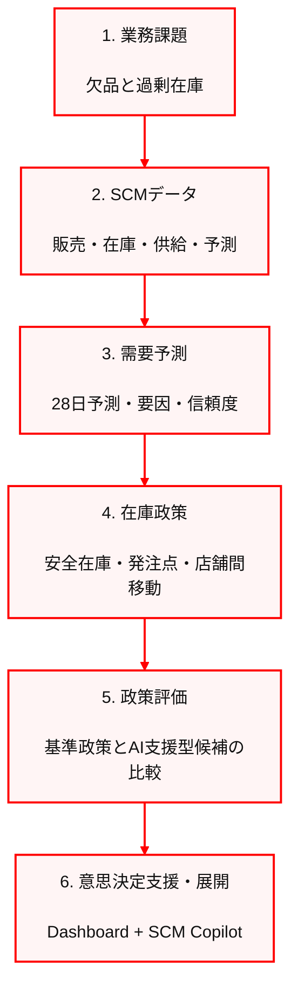
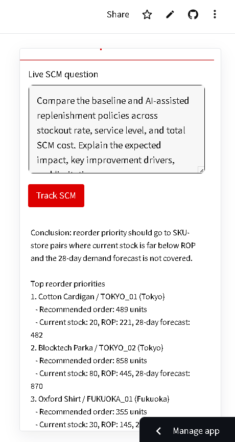
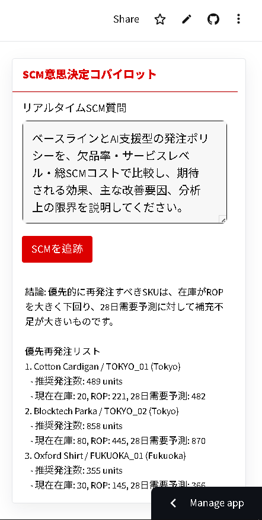

# SCM AI Analytics Business

**小売サプライチェーンを対象とした、説明可能な需要予測・在庫政策最適化・意思決定支援システム**

[English technical documentation](README.md)

## システム概要

本システムは、SKU・店舗単位の需要予測を起点として、安全在庫、発注点、補充量、店舗間在庫移動、政策比較を一つの分析フローに統合します。分析結果はStreamlit上の意思決定ワークスペースと、検証済みテーブルのみを参照するSCM Copilotから確認できます。

**稼働環境:** [scm-ai-analytics-business.streamlit.app](https://scm-ai-analytics-business.streamlit.app)

公開環境では合成データのみを使用しています。顧客情報、従業員情報、連絡先、決済情報、認証情報は含まれていません。



## 対象業務と意思決定

主な意思決定単位はSKU・店舗ペアです。

1. 28日間の需要量を予測する
2. 需要変動、リードタイム、サービス水準から安全在庫と発注点を算出する
3. 在庫不足度と予測カバレッジから補充優先順位を決定する
4. 同一SKUの余剰店舗と不足店舗を照合し、店舗間移動候補を生成する
5. 現行相当の基準政策とAI支援型候補政策を、欠品率・サービス水準・総SCMコスト指標で比較する
6. 根拠、制約、次のアクションを英語・日本語・韓国語で提示する

## 現在の意思決定指標

| 指標 | 値 | 定義 |
|---|---:|---|
| SKU・店舗ペア | 60 | 予測・在庫政策の分析粒度 |
| 欠品リスク | 26 | 現在庫が算出発注点を下回るペア |
| 過剰在庫 | 3 | 店舗間移動または発注回避の候補 |
| 推奨発注数 | 21,727 | 28日需要と安全在庫を満たす合計数量 |
| 説明カバレッジ | 100% | 全ペアに診断用の需要要因情報を付与 |

## 需要予測の検証

### 検証設計

- 時系列順のrolling-origin backtest
- 重複しない3つの予測起点
- 各起点の予測期間は28日
- 60 SKU・店舗ペア
- モデルごとに5,040件の実績値で評価
- 各起点より後の需要実績は特徴量作成に使用しない

### モデル比較

| 順位 | モデル | WAPE | MAE | Bias |
|---:|---|---:|---:|---:|
| 1 | Global gradient boosting | **17.97%** | **4.97** | -1.81% |
| 2 | 28日移動平均 | 21.45% | 5.93 | -3.75% |
| 3 | 指数加重平均 | 21.69% | 6.00 | +1.04% |
| 4 | 曜日別seasonal naive | 21.99% | 6.08 | -5.81% |



Gradient boostingは全ての予測起点および需要速度区分で最小WAPEとなりました。最良の単純基準モデルである28日移動平均に対して、WAPEは3.48ポイント、相対値で16.2%低下しています。一方、全体Biasは-1.81%であり、高需要SKUでは過小予測傾向が残ります。



詳細は[Forecast Validation](docs/FORECAST_VALIDATION.md)に記載しています。

## 在庫政策

```text
安全在庫 = 日次需要標準偏差 × サービス水準Z値 × √リードタイム
発注点   = 平均日次需要 × リードタイム + 安全在庫
目標在庫 = 28日需要予測 + 安全在庫
推奨発注 = max(目標在庫 - 現在庫, 0)
```

推奨結果には、現在庫、発注点、安全在庫、28日需要予測、推奨数量、優先度、判断根拠を保持します。店舗間移動は、同一SKUに不足店舗と余剰店舗が同時に存在する場合のみ生成し、数量は供給側余剰と需要側不足の小さい方を上限とします。

## オフライン政策評価

| 指標 | 基準政策 | AI支援型候補 | 差分 |
|---|---:|---:|---:|
| 欠品率 | 71.7% | 70.0% | -1.7ポイント |
| サービス水準 | 92.9% | 94.9% | +2.0ポイント |
| 総SCMコスト指標 | ¥11,351,887 | ¥8,493,779 | -25.2% |

SKU・店舗ペアを対応のある分析単位として、連続指標には対応のあるt検定、欠品状態にはMcNemar正確検定を適用しています。欠品状態の差は5%水準で有意ではありません。その他のコスト・サービス指標の有意性は、合成シミュレーション内部の整合性を示すものであり、本番環境の因果効果を示すものではありません。

## 政策感度分析

サービス水準、逸失売上、保有費、発注処理費の前提を変更した81シナリオを評価しました。

| パラメータ | 評価値 |
|---|---|
| 目標サービス水準 | 90%、95%、97% |
| 逸失売上コスト倍率 | 0.75、1.00、1.25 |
| 保有コスト倍率 | 0.75、1.00、1.25 |
| 発注処理コスト倍率 | 0.75、1.00、1.25 |

候補政策は、評価対象の全81シナリオで基準政策より低いシミュレーションコストとなりました。削減率の範囲は23.16%から26.43%です。



この結果は、設定した範囲内での内部頑健性を示します。生産能力、ケースパック、最小発注量、賞味期限、距離別輸送費、需要分布は未反映であるため、本番導入前に財務・物流部門とコスト前提を再設定する必要があります。

詳細は[Inventory Policy Sensitivity Analysis](docs/POLICY_SENSITIVITY.md)に記載しています。

## システム構成



## SCM Copilot

Copilotは次の管理対象intentに限定されています。

- 欠品リスクと再発注優先順位
- 安全在庫と発注点の説明
- 店舗間移動候補
- 基準政策と候補政策の比較

公開環境で外部モデル認証情報が設定されていない場合は、検証済み分析テーブルから決定論的に回答します。任意のGemini連携は環境変数で分離し、提供コンテキスト以外の数値生成を禁止する指示を使用します。

<table>
  <tr>
    <th width="50%">English</th>
    <th width="50%">日本語</th>
  </tr>
  <tr>
    <td valign="top"></td>
    <td valign="top"></td>
  </tr>
</table>

## セキュリティ・個人情報保護

- バージョン管理対象のデータは全て合成データ
- 顧客単位・従業員単位のデータは不使用
- メールアドレス、電話番号、住所、決済情報、アカウント番号をデータ契約テストで禁止
- `.env`、Streamlit secrets、サービスアカウント、展開キーをGit管理対象外に設定
- 公開デモから発注実行、在庫更新、外部システム変更は不可
- 外部LLM認証情報がない場合、質問内容を外部送信しない
- 検索エンジン向け`noindex`は補助制御であり、認証の代替とはしない

詳細は[Security and Privacy](SECURITY.md)および[Deployment, Privacy, and Operations](docs/DEPLOYMENT_AND_PRIVACY.md)に記載しています。

## 再現手順

```bash
python -m venv .venv
source .venv/bin/activate  # Windows: .venv\Scripts\activate
python -m pip install -r requirements.txt

python -m src.scm_engine
python -m src.forecast_backtesting
python -m src.policy_evaluation_simulation
python -m src.policy_sensitivity_analysis
python -m src.analysis_visuals
python -m pytest -q
python -m streamlit run app.py
```

## 分析上の制約

- データは合成データであり、本番運用の実績ではありません。
- 需要予測履歴は180日であり、年間季節性の検証には不十分です。
- 政策比較はランダム化比較試験ではありません。
- 総SCMコストは意思決定用の代理指標であり、会計予測ではありません。
- 本番導入にはshadow mode、承認フロー、監査ログ、役割別アクセス制御、実績効果モニタリングが必要です。

## 技術文書

- [Business Case](docs/BUSINESS_CASE.md)
- [Architecture and Data Contracts](docs/ARCHITECTURE.md)
- [Forecast Validation](docs/FORECAST_VALIDATION.md)
- [Modeling and Evaluation](docs/MODELING_AND_EVALUATION.md)
- [Inventory Policy Sensitivity Analysis](docs/POLICY_SENSITIVITY.md)
- [Decision Intelligence and Copilot](docs/DECISION_INTELLIGENCE.md)
- [Deployment, Privacy, and Operations](docs/DEPLOYMENT_AND_PRIVACY.md)

## ライセンス

MIT License. See [LICENSE](LICENSE).

