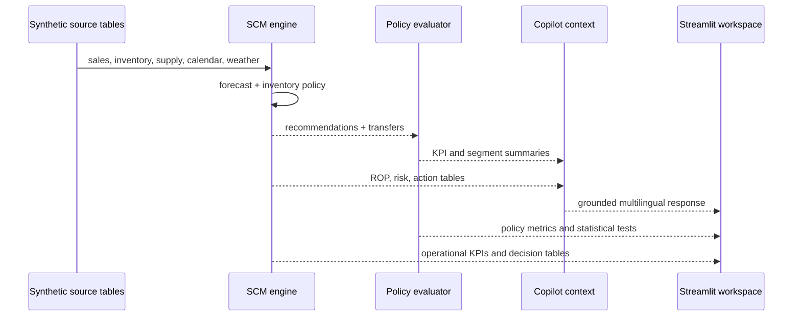

# Architecture and Data Contracts

## Design goals

The system is designed around four senior-level engineering concerns:

1. **decision grain:** every operational output resolves to a SKU-store pair;
2. **traceability:** recommendations retain the forecast, inventory policy, and rationale used to produce them;
3. **separation of concerns:** analytical computation, evaluation, agent context, and presentation are independent layers;
4. **safe degradation:** the application remains useful when no external LLM is configured.

## Component model

| Layer | Responsibility | Primary implementation |
|---|---|---|
| Data | Synthetic POS, inventory, supply, stores, products, weather, calendar | `data/*.csv` |
| Forecasting | Recent demand statistics and deterministic 28-day forecast | `src/scm_engine.py` |
| Inventory policy | Safety stock, ROP, days of supply, stock state | `src/scm_engine.py` |
| Decisioning | Replenishment priority and store-transfer matching | `src/scm_engine.py` |
| Evaluation | Baseline/candidate simulation and paired tests | `src/policy_evaluation_simulation.py` |
| Explainability | Historical driver signals and confidence labels | `app.py::build_forecast_explanations` |
| Copilot | Intent routing, data context, concise decision narratives | `src/agent.py` |
| Product | Multilingual filters, KPIs, charts, tables, persistent Copilot | `app.py` |

## Data flow

## Output contracts

| Dataset | Grain | Key fields | Consumer |
|---|---|---|---|
| `forecast.csv` | date × store × SKU | `forecast_units` | dashboard, replenishment |
| `inventory_policy.csv` | store × SKU | `safety_stock`, `rop`, `stock_status` | dashboard, agent |
| `recommendations.csv` | store × SKU | `forecast_28d`, `recommended_order_qty`, `risk_score`, `priority` | action table, agent |
| `transfer_recommendations.csv` | source × destination × SKU | `transfer_qty`, `reason` | transfer view, agent |
| `policy_eval_results.csv` | policy × store × SKU | fulfillment, costs, stockout flag | statistical evaluation |
| `policy_eval_kpi_summary.csv` | policy | stockout, service, cost | KPI comparison, agent |
| `policy_eval_segment_summary.csv` | policy × city × category | cost and service outcomes | improvement-driver view |

## Failure boundaries

- Missing required CSV files stop the app with a visible data-readiness warning.
- Missing model credentials do not stop the Copilot; local deterministic responses remain available.
- The agent consumes bounded summaries rather than arbitrary files or untrusted retrieval results.
- Policy results are labeled as simulation outputs to prevent accidental causal interpretation.

## Production evolution

A production implementation would replace CSV contracts with versioned warehouse tables, feature-store views, and an orchestration layer. The same logical contracts can remain stable while adding model registry, data-quality gates, lineage, drift monitoring, and role-based access.
